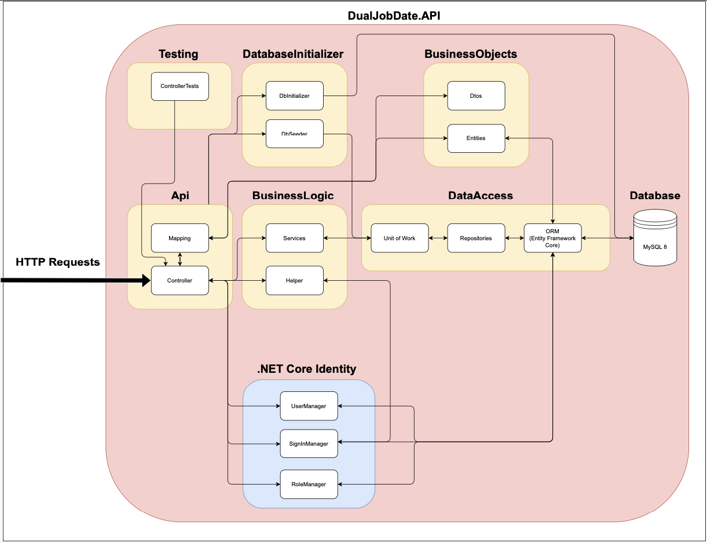
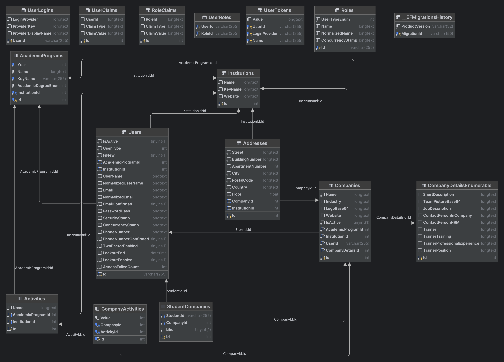

# DualJobDate.API - Backend Architecture

## Overview

This ReadMe document provides an overview of the architecture and components of the DualJobDate.API, an ASP.NET Core Web API designed for handling HTTP Requests integrating .NET Core Identity for authentication and authorization.

## Architecture Components

The application is divided into several layers:
- Api
- Business Objects
- Business Logic
- Data Access
- Database Initializer
- Testing

### HTTP Requests
All interactions with the API are initiated through HTTP requests. We use .NET Core Identity for authentication and authorization. The Authentication works Bearer Token that gets generated during the login process.

### API Layer
- **Controller**: Controllers are the entry point of the API. They interpret HTTP requests and delegate operations to appropriate services within the Business Logic layer.

### Business Logic Layer
- **Services**: Contains the core business operations of the API. Business logic is executed here and use interfaces to access the Data Access Layer.
- **Helper**: Utility functions that support the business services.

### Business Objects
- **DTO - Data Transfer Objects**: Use DTOs to transfer data between Buisness Logic Layer and API Layer
- **Entities**: Entities that are used in the DualJobDate Project
- **Models**: Request models for deserializing Json Request Body in HTTP Requests
- **Enum**: Enumerated Types for Academic Degrees and User in Roles
- 
### Data Access Layer
- **Repositories**: Abstraction layer that allows the application to access the database entities in a collection-like manner.
- **Unit of Work**: Manages transactions, ensuring consistent changes to the database.
- **ORM (Entity Framework Core)**: Maps objects to database tables and simplifies data manipulation.

### Database Initializer
- **DbInitializer**: Initializes the database structure.
- **DbSeeder**: Populates the database with initial or test data.

### Testing
- **ControllerTests**: Tests functionality of controllers.

### Database
- **MySQL 8**: The database where all data is stored and managed.

# DualJobDate.API - Database Scheme

## Overview

## Entities

### User : IdentityUser
User, which inherits from IdentityUser. Every User must have an Institution and AcademicProgram.

### Role : IdentityRole
Role, which inherits from IdentityRole. Each Role is assigned to a UserType Enum.

Enum:
1. UserType.Admin
2. UserType.Institution
3. UserType.Company
4. UserType.Student

There are following roles:

- **Admin**: Can create, read, update and delete every User, Company and Likes. Institution: 0, AcademicProgram: 0
- **Institution**: Can create, read, update and delete every User, Company and Likes within Institution. AcademicProgram: 0
- **Company**: Can read, update and delete company assigned to this user.
- **Student**: Can read Companies within the AcademicProgram and create, read, update and delete Likes assigned to this user.

### Institution
 
Institution represents an institution of the University.

Seeded : ID
- AdminInstitution : 1
- IIT : 2

### AcademicProgram

AcademicProgram represents the academic program of an institution.

Seeded : ID
- AdminInstitution : 1, AdminAcademicProgram : 1
- IIT : 2, MSD : 2

### Activity

Academic Programs have activities that companies must address.

Seeded : ID
- Informatik : 1
- Betriebssysteme & Datenmanagement : 2
- Web Engineering : 3
- Datenbanken : 4
- Objektorientierte Programmierung : 5

### Company

Represents a company. Each Company must have a User, Institution and AcademicProgram.

### CompanyDetails

Represents details of a company.

### CompanyActivity

Addressed company activities with values from 0 to 5 for companies.

### Address
Represents the adress of a company.

### StudentCompany

Represents a Like from a Student to a Company.

### Identity Entities

There are several Entities created automatically by .NET Core Identity like UserLogins, UserClaims, RoleClaims, UserRoles, UserTokens.
These entities can be used for future purposes.

UserRoles assigns a role to every user.

### EF-Core Entities

__EfMigrationsHistory is an Entity created by .NET EF-Core and shows the history of every Migration.

